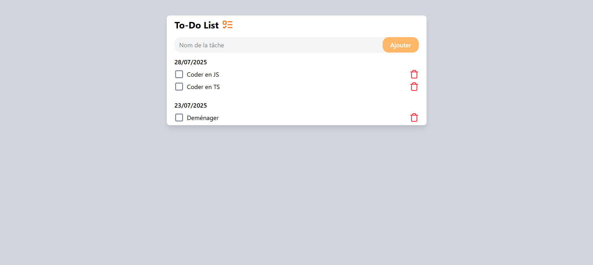

# Todo List 📝

Une application de gestion de tâches (Todo List) moderne, développée avec React, TypeScript et Vite.

## Aperçu



## Fonctionnalités

- Ajouter, modifier et supprimer des tâches
- Marquer les tâches comme terminées
- Filtrer les tâches (à faire / terminées)
- Interface réactive et moderne

## Prérequis

- Node.js >= 16
- pnpm (recommandé)

## Installation

Clonez le dépôt puis installez les dépendances :

```bash
pnpm install
```

## Lancement du projet

Pour démarrer le serveur de développement :

```bash
pnpm dev
```

L’application sera accessible sur [http://localhost:5173](http://localhost:5173).

## Utilisation rapide

1. Ajoutez une nouvelle tâche via le formulaire.
2. Cochez une tâche pour la marquer comme terminée.
3. Supprimez ou modifiez une tâche selon vos besoins.

## Technologies utilisées

- [React](https://react.dev/)
- [TypeScript](https://www.typescriptlang.org/)
- [Vite](https://vitejs.dev/)
- [pnpm](https://pnpm.io/) (gestionnaire de paquets)

## Contribution

Les contributions sont les bienvenues ! Pour proposer une amélioration :

1. Forkez le projet
2. Créez une branche (`git checkout -b feature/ma-nouvelle-fonctionnalite`)
3. Commitez vos modifications (`git commit -m 'Ajout d\'une nouvelle fonctionnalité'`)
4. Poussez la branche (`git push origin feature/ma-nouvelle-fonctionnalite`)
5. Ouvrez une Pull Request

## Licence

Ce projet est sous licence MIT. Voir le fichier [LICENSE](LICENSE) pour plus d’informations.
